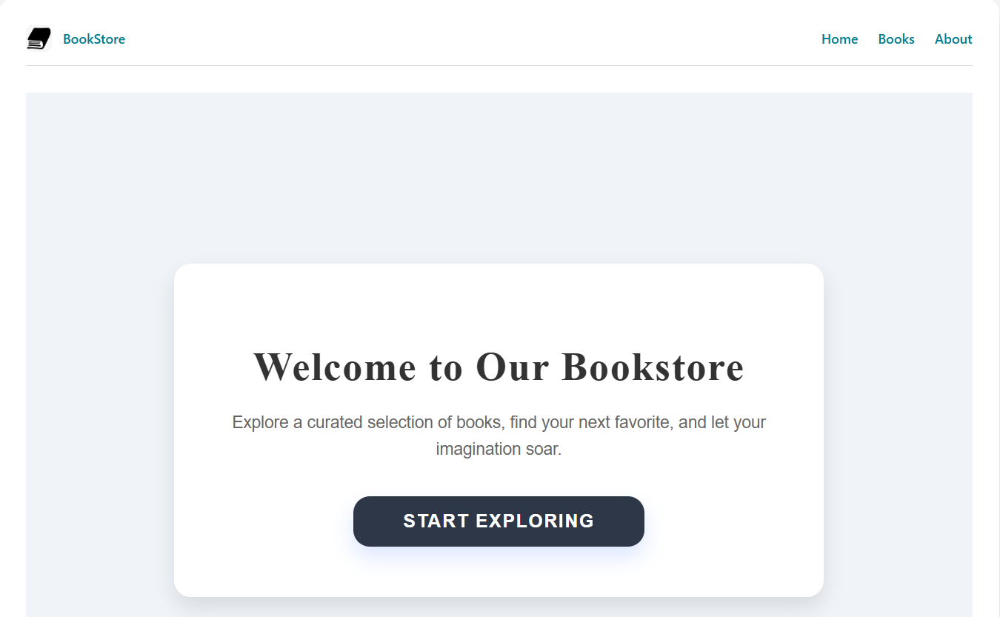
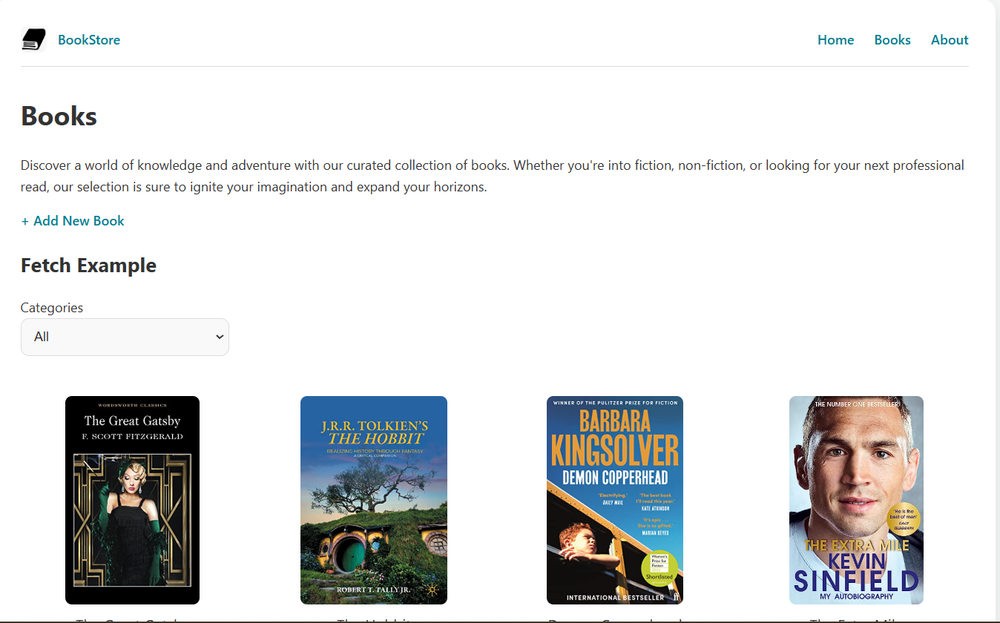
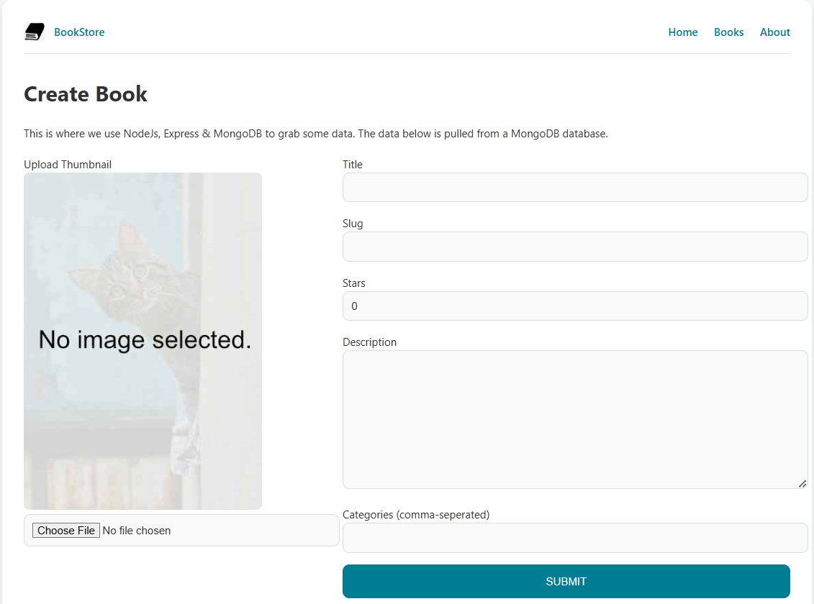
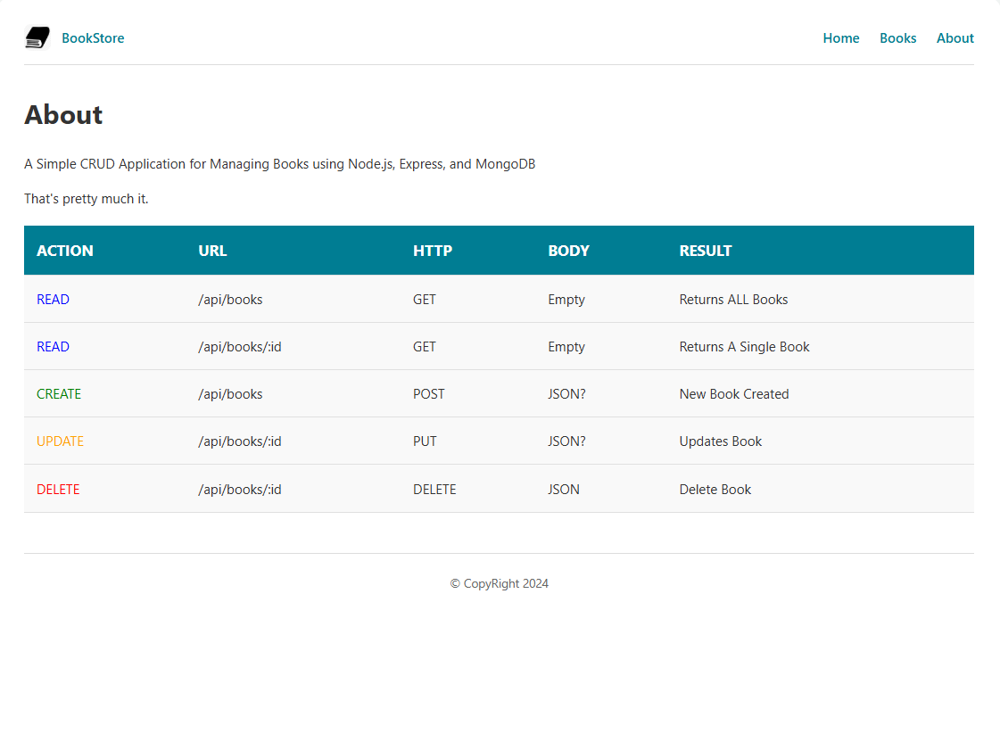

# Book Store using MERN

A bookstore web app where users can add, edit, and manage books, with filtering options. Built with React.js, it demonstrates CRUD operations and book management functionality.

## Tech Stack

**Client:** React, CSS 

**Server:** Node, Express, MongoDB

## Screenshots

